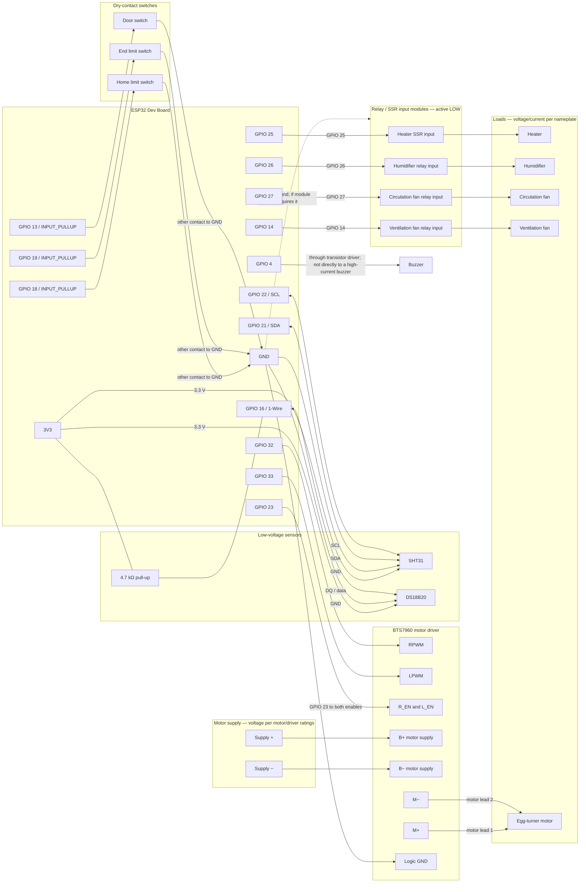

# EggIncubator Pro — Hardware Wiring

This is a low-voltage wiring reference for the current firmware pin map, not a
certified circuit schematic. Confirm the exact ESP32 board and every module's
datasheet before wiring. The current firmware uses GPIO 16 for the DS18B20;
GPIO 16 may be reserved on ESP32 modules with PSRAM.

## Connection diagram

## Pin-to-wire reference

| ESP32 pin | Connect to | Notes |
|---|---|---|
| 3V3, GND | SHT31 VIN/VCC, GND | Use the sensor breakout's supported supply voltage. |
| GPIO 21, GPIO 22 | SHT31 SDA, SCL | I²C; SHT31 address is configured as `0x44`. |
| GPIO 16, 3V3, GND | DS18B20 DQ, VDD, GND | Add a 4.7 kΩ pull-up from DQ to 3V3. Confirm GPIO 16 is available on the specific board. |
| GPIO 25, 26, 27, 14 | Heater SSR, humidifier, circulation fan, ventilation relay inputs | Firmware configures these as active-low (`RELAY_ON=LOW`). Use 3.3 V-compatible inputs; verify the module's input polarity and isolation. |
| GPIO 32, GPIO 33 | BTS7960 RPWM, LPWM | Firmware drives these as direction outputs, not variable-speed PWM. |
| GPIO 23 | BTS7960 R_EN and L_EN | Tie both enable inputs together only if the driver's datasheet permits it. |
| GPIO 18, 19, 13 | Home limit, end limit, door switch | Each normally-open dry contact goes between its GPIO and ESP32 GND; firmware uses `INPUT_PULLUP`. Check switch polarity and desired fail-safe behavior. |
| GPIO 4 | Buzzer driver input | Use a transistor/MOSFET driver if the buzzer current exceeds the GPIO rating; add suppression for an inductive load. |

## Power and safety

- Power the ESP32 from its rated USB/5 V input. Power the motor and loads from
  supplies rated for their voltage and current; do not power them from ESP32
  GPIO pins or the 3.3 V rail.
- Join grounds for the low-voltage ESP32, sensor, relay logic, and motor-driver
  logic where required by the module datasheets. Keep relay isolation barriers
  intact.
- The diagram does not specify heater or mains wiring. Use properly rated
  enclosures, fusing, strain relief, clearances, and an independent thermal
  cutoff. Have mains wiring designed and checked by a qualified electrician.
- Test relay polarity and motor direction with loads disconnected first.
  Confirm all outputs stay off at boot, reset, and power loss. The software
  safe state cannot guarantee the electrical behavior of the relay hardware.
- Confirm the selected ESP32 board exposes every listed GPIO and that none are
  reserved by flash/PSRAM or board peripherals before connecting hardware.
- The current firmware configures the limit-switch and door GPIOs, but does not
  yet read them or apply safety logic based on their state.
