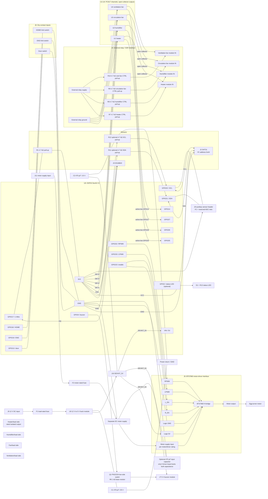

# EggIncubator Pro — Low-Voltage Wiring Schematic

This schematic is derived from the firmware pin map in `include/pins.h` and the hardware interfaces described by the project; it does not depend on the reference image. U5 is shown as a symbolic ESP32 DevKit V1 module interface, with project-used GPIO functions and a 5 V VIN connection; it is not a bare ESP32 chip or the exact physical pinout of every DevKit variant. The drawing also covers four PC817 relay-control channels and output pull-ups, a buzzer transistor driver, a fused 12 V-to-5 V converter interface with bulk capacitors, and an auxiliary sensor header. It remains a module-level reference, not a production PCB or mains-wiring drawing.

## Connection and power notes

| Interface | ESP32 connection | Module/load connection |
|---|---|---|
| SHT31 (J2) | GPIO 21 SDA, GPIO 22 SCL, 3V3, GND | Use I²C address `0x44`; keep SDA/SCL separate from 1-Wire |
| DS18B20 (J3) | GPIO 17 DQ, 3V3, GND | R1 is the 4.7 kΩ pull-up from DQ to 3V3 |
| Relay interface (J4) | GPIO 25/26/27/14 drive U1-U4 PC817 LEDs through 330 Ω | R7-R10 pull up isolated CTRL outputs; pins 5-6 provide `RELAY_VCC`/`RELAY_GND` |
| BTS7960 interface (J5) | GPIO 32 to RPWM, GPIO 33 to LPWM, GPIO 23 to both R_EN and L_EN | Connect motor output and a separate motor supply according to the driver and motor ratings |
| Limit switches (J6) | GPIO 18 HOME, GPIO 19 END | Dry contacts to GND; firmware uses `INPUT_PULLUP` |
| Door switch (J6) | GPIO 13 | Dry contact to GND; firmware uses `INPUT_PULLUP` |
| Buzzer (J7) | GPIO 4 through R6 (1 kΩ) to Q1 PN2222A base | J7 supplies the buzzer from `DEVKIT_5V`; confirm module voltage/current rating |
| Auxiliary sensors (J8) | J8 exposes 3V3, GND, SDA, SCL, and two reserved ADC nets | ADC nets are not assigned to firmware GPIOs yet; check sensor voltage before connecting |
| Status LED (D1/R13) | GPIO 2 through R13 (1 kΩ) and D1 to GND | GPIO 2 is a boot-strapping pin; ensure the LED circuit does not prevent boot |

- U5 is a schematic symbol for an ESP32 DevKit V1 module interface, not a board-specific footprint. GPIO assignments follow the firmware; verify the physical board's pin labels and VIN/USB power arrangement before wiring.
- J9/F1/U9/J10 show a 12 V DC input, series fuse, generic buck module, and 5 V `DEVKIT_5V` input. C1/C2 show illustrative 470 µF bulk decoupling to GND; validate voltage, ripple, inrush, fuse, and converter current ratings for the actual design. Do not connect USB and external 5 V together unless the selected DevKit allows it.
- Relay channels are active-low: a LOW GPIO turns on its PC817 LED. Each open-collector output has a 4.7 kΩ pull-up to the isolated `RELAY_VCC` rail and is pulled low by its PC817. J4 pins 5–6 are external supply input/return connections for `RELAY_VCC` and `RELAY_GND`; the board does not generate this isolated supply. Use only a voltage accepted by the selected relay module (no single relay-side voltage is specified here). Verify optocoupler sink current and logic thresholds, and keep `RELAY_GND` separate from MCU GND.
- The 330 Ω input resistors provide roughly 6 mA LED current from a 3.3 V rail with a typical PC817 LED drop. Verify worst-case PC817 CTR/output sink current against the actual relay/SSR input; use an additional suitable driver if it is insufficient. The schematic does not guarantee compatibility with arbitrary modules.
- Sensor power is 3.3 V only for sensors rated for it. J8's ADC nets are reserved; select safe ESP32 ADC pins and update firmware before using them.
- R11/R12 provide optional 4.7 kΩ I²C pull-ups and are marked DNP; populate only if the connected sensor modules do not already provide suitable pull-ups.
- J11/F2 are an explicit, separately fused motor-supply input to the BTS7960 `VMOT_PLUS` pin. Choose the fuse from motor stall/inrush current, wiring, and module ratings; the motor positive rail is not supplied by the 5 V buck.
- Keep the motor supply positive separate from the ESP32 USB/5 V rail. A typical BTS7960 module has common logic and motor return; J5 therefore connects both grounds to system GND. Confirm this against the exact driver board before wiring.
- C3 is optional and DNP by default; populate a correctly rated bulk capacitor near the BTS7960 supply only if the selected module does not already provide adequate input capacitance. Do not place a capacitor across switched motor outputs unless the exact driver manufacturer recommends it.
- Heater and other load-side wiring is intentionally not specified: the project does not identify load voltages, currents, or exact relay/SSR models. Use correctly rated, isolated switching devices, appropriate fusing/enclosures, and qualified mains wiring where applicable. Never connect mains voltage to the ESP32 or low-voltage side.
- Converter and connector footprints, load-dependent fuse ratings, PCB placement/routing, creepage/clearance, thermal design, and DRC remain to be completed after exact modules and loads are selected. This schematic is not ready for PCB fabrication.
