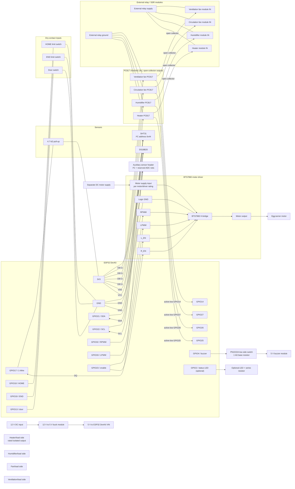

# EggIncubator Pro — Low-Voltage Wiring Schematic

This schematic documents the firmware pin map in `include/pins.h` and expands it with four PC817 relay-control channels, a buzzer transistor driver, a generic 12 V-to-5 V converter interface, and an auxiliary sensor header. It remains a module-level reference, not a production PCB or mains-wiring drawing.

## Connection and power notes

| Interface | ESP32 connection | Module/load connection |
|---|---|---|
| SHT31 | GPIO 21 SDA, GPIO 22 SCL, 3V3, GND | Use I²C address `0x44`; keep SDA/SCL separate from 1-Wire |
| DS18B20 | GPIO 17 DQ, 3V3, GND | Fit a 4.7 kΩ pull-up from DQ to 3V3 |
| Heater SSR | GPIO 25 drives a PC817 LED through 330 Ω | PC817 collector sinks the external module IN; supply it from its own relay-side rail |
| Humidifier relay | GPIO 26 drives a PC817 LED through 330 Ω | Check optocoupler sink-current capability against module input current |
| Circulation fan relay | GPIO 27 drives a PC817 LED through 330 Ω | Check optocoupler sink-current capability against module input current |
| Ventilation fan relay | GPIO 14 drives a PC817 LED through 330 Ω | Check optocoupler sink-current capability against module input current |
| BTS7960 | GPIO 32 to RPWM, GPIO 33 to LPWM, GPIO 23 to both R_EN and L_EN | Connect motor output and a separate motor supply according to the driver and motor ratings |
| Limit switches | GPIO 18 HOME, GPIO 19 END | Dry contacts to GND; firmware uses `INPUT_PULLUP` |
| Door switch | GPIO 13 | Dry contact to GND; firmware uses `INPUT_PULLUP` |
| Buzzer | GPIO 4 through R6 (1 kΩ) to PN2222A base | J7 supplies the buzzer from 5 V; confirm module voltage/current rating |
| Auxiliary sensors | J8 exposes 3V3, GND, SDA, SCL, and two reserved ADC nets | ADC nets are not assigned to firmware GPIOs yet; check sensor voltage before connecting |
| Status LED (optional) | GPIO 2 | Add a series resistor; GPIO 2 is a boot-strapping pin, so ensure external circuitry does not prevent boot |

- J9/U9/J10 show an optional 12 V DC input, generic buck module, and 5 V DevKit input. Verify the selected converter's voltage, current, polarity, and fuse requirements. Do not connect USB and external 5 V together unless the selected DevKit allows it.
- Relay channels are active-low: a LOW GPIO turns on its PC817 LED. The output side is an open-collector sink; connect each external relay input and its relay-side supply/ground as required by that module. Keep `RELAY_GND` separate from MCU GND if isolation is required.
- The 330 Ω input resistors provide roughly 6 mA LED current from a 3.3 V rail with a typical PC817 LED drop. Verify worst-case PC817 CTR/output sink current against the actual relay/SSR input; use an additional suitable driver if it is insufficient. The schematic does not guarantee compatibility with arbitrary modules.
- Sensor power is 3.3 V only for sensors rated for it. J8's ADC nets are reserved; select safe ESP32 ADC pins and update firmware before using them.
- Keep the motor supply separate from the ESP32 USB supply. Connect the driver logic ground to ESP32 GND; observe the driver board's power-input and grounding instructions.
- Heater and other load-side wiring is intentionally not specified: the project does not identify load voltages, currents, or exact relay/SSR models. Use correctly rated, isolated switching devices, appropriate fusing/enclosures, and qualified mains wiring where applicable. Never connect mains voltage to the ESP32 or low-voltage side.
- Converter and connector footprints, load-dependent fuse ratings, PCB placement/routing, creepage/clearance, thermal design, and DRC remain to be completed after exact modules and loads are selected. This schematic is not ready for PCB fabrication.
