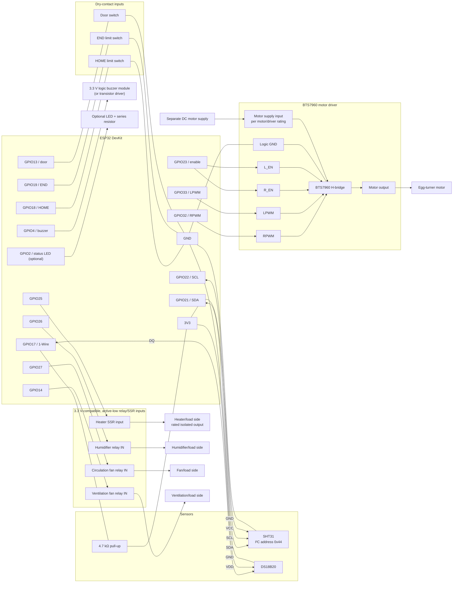

# EggIncubator Pro — Low-Voltage Wiring Schematic

This schematic documents the firmware pin map in `include/pins.h`. It covers ESP32 control wiring and module interfaces; it is not a mains-wiring or PCB-fabrication drawing.

## Connection and power notes

| Interface | ESP32 connection | Module/load connection |
|---|---|---|
| SHT31 | GPIO 21 SDA, GPIO 22 SCL, 3V3, GND | Use I²C address `0x44`; keep SDA/SCL separate from 1-Wire |
| DS18B20 | GPIO 17 DQ, 3V3, GND | Fit a 4.7 kΩ pull-up from DQ to 3V3 |
| Heater SSR | GPIO 25 to control input | Use an input-compatible, active-low module; load side must be rated and isolated for the heater |
| Humidifier relay | GPIO 26 to IN | Module supply and load rating per its datasheet |
| Circulation fan relay | GPIO 27 to IN | Module supply and load rating per its datasheet |
| Ventilation fan relay | GPIO 14 to IN | Module supply and load rating per its datasheet |
| BTS7960 | GPIO 32 to RPWM, GPIO 33 to LPWM, GPIO 23 to both R_EN and L_EN | Connect motor output and a separate motor supply according to the driver and motor ratings |
| Limit switches | GPIO 18 HOME, GPIO 19 END | Dry contacts to GND; firmware uses `INPUT_PULLUP` |
| Door switch | GPIO 13 | Dry contact to GND; firmware uses `INPUT_PULLUP` |
| Buzzer | GPIO 4 | Use a 3.3 V-logic buzzer module or a transistor driver; do not exceed ESP32 GPIO current limits |
| Status LED (optional) | GPIO 2 | Add a series resistor; GPIO 2 is a boot-strapping pin, so ensure external circuitry does not prevent boot |

- Power the ESP32 by USB. Power sensors from 3.3 V.
- Select relay/SSR modules whose control inputs are compatible with 3.3 V GPIO and the firmware's active-low relay logic (`RELAY_ON = LOW`). Follow each module's datasheet for its coil/control supply and whether grounds should be common; do not apply 5 V to an ESP32 GPIO.
- Keep the motor supply separate from the ESP32 USB supply. Connect the driver logic ground to ESP32 GND; observe the driver board's power-input and grounding instructions.
- Heater and other load-side wiring is intentionally not specified: the project does not identify load voltages, currents, or exact relay/SSR models. Use correctly rated, isolated switching devices, appropriate fusing/enclosures, and qualified mains wiring where applicable. Never connect mains voltage to the ESP32 or low-voltage side.
